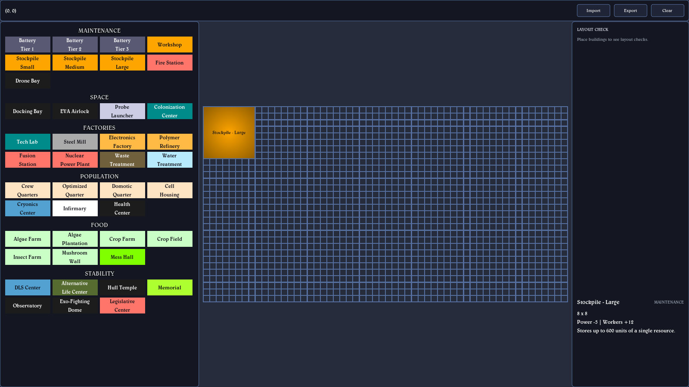
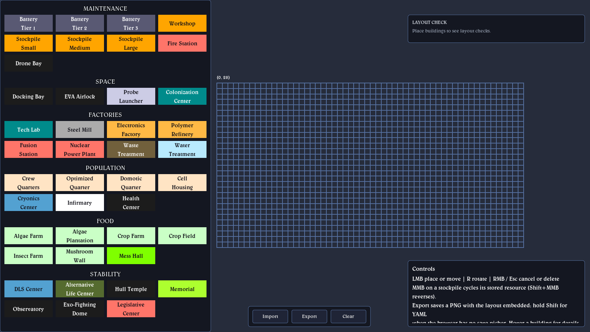
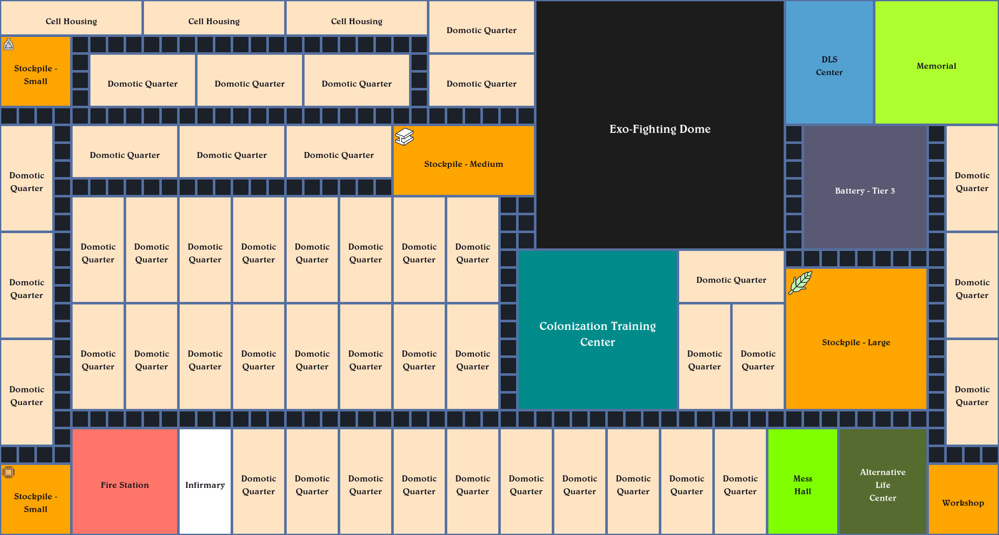

# IXION Sector Builder (modded offline edition)

A planning tool for [IXION](https://store.steampowered.com/app/1113120/IXION/) - the space-station
city builder by Bulwark Studios (Kasedo Games, 2022), where you lead the starship Tiqqun, juggle
power, hull and stability, and design sectors for your crew. This tool lets you lay out a full
56x30 sector on a grid outside the game, sanity-check it, and save or share the result.

Based on [N8Dawg's Ixion Sector Builder](https://n8dawg.itch.io/ixion-sector-builder) - huge thanks
to the author for the original! This repo is a modded offline mirror of it (upstream build 7047666).



## What this edition adds over the original

- Runs offline from `file://`: open `local.html`, no server needed.
- ~1.5x larger grid and a window-filling viewport (no letterbox).
- Fixed 4-column tile palette grouped by category, with proper in-game building names.
- Hover info panel: size, power/worker stats and a short description per building.
- LAYOUT CHECK panel with errors (no Mess Hall / no Workshop / quarters below required workers,
  import overlaps / out-of-bounds) and warnings (no Fire Station / DLS Center / Memorial /
  Infirmary, stored power < 700, quarters below 800).
- Stockpile resource markers: MMB on a placed stockpile cycles its stored resource
  (Shift+MMB reverses); drawn as an icon and saved in the export.
- Single-file PNG export with the layout embedded; YAML export too. Import accepts both.
- Rotation remembered per building type; Esc cancels.



## Run

- Live demo: https://sladethe.github.io/ixion-sector-builder/
- Offline: download/clone the repo and open `local.html` in a browser (double-click works).
- Over HTTP: serve the folder and open `index.html`.
- Chromium browsers use the save-file picker; elsewhere a plain download is used instead,
  and Shift+Export (Ctrl+Shift+S) saves YAML.

## Controls

| Input | Action |
|---|---|
| LMB | place / move building |
| R | rotate |
| RMB / Esc | cancel / delete |
| MMB on a stockpile | cycle stored resource (Shift+MMB reverses) |
| Ctrl+O / Ctrl+S | import / export |

Buttons: Import / Export / Clear. The last used file name is remembered between sessions.

## Export file format

YAML layout (also embedded verbatim in exported PNGs):

```yaml
# IXION sector builder layout
sector: 56x30
buildings:
  - name: "Stockpile - Small"
    pos: [0, 26]
    size: [4, 4]
    resource: "Electronics"   # optional; stockpiles only
```

Positions are the top-left cell, 0-based, x right / y down. `resource` is one of the 11 storable
types: Iron, Alloy, Carbon, Polymer, Silicon, Electronics, Food, Ice, Hydrogen, Waste, Cryopod.

The exported PNG is a 2x render of the grid with the YAML stored in a PNG `tEXt` chunk
(keyword `ixion-layout`) inserted before `IEND`, so one file carries both the picture and the
editable layout:



## Build from source

Uses Godot 3.5.1 (the upstream engine version). From the repo root:

1. Export the pack: `Godot_v3.5.1-stable_win64.exe --no-window --path src --export-pack HTML5 index.pck`
   (lands in `src/index.pck`; move it to the repo root).
2. Update the `index.pck` size in `local.html` (`GODOT_CONFIG.fileSizes`).
3. Regenerate the base64 embeds: `powershell -File rebuild-embeds.ps1`.

See `AGENTS.md` for the full development guide.

## License & attribution

- The original Ixion Sector Builder is by N8Dawg, published free on itch.io; `upstream/index.pck`
  is the pristine upstream pack. Upstream content remains the author's - this project's
  modifications and additions are MIT (see `LICENSE`).
- Unofficial fan project. IXION is a trademark/copyright of Bulwark Studios / Kasedo Games;
  building names and stats are used for reference only. No game assets are bundled
  (resource icons were redrawn from scratch).
- Everything here was vibecoded with the help of GLM 5.3 and Qwen 3.8 MAX.
